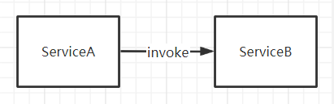
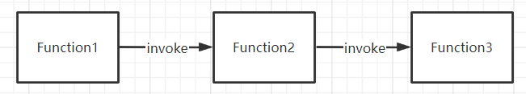
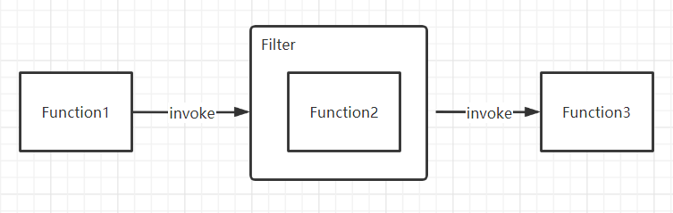
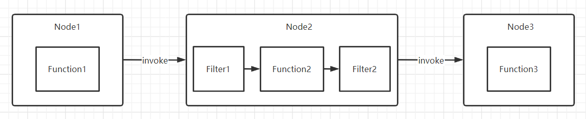
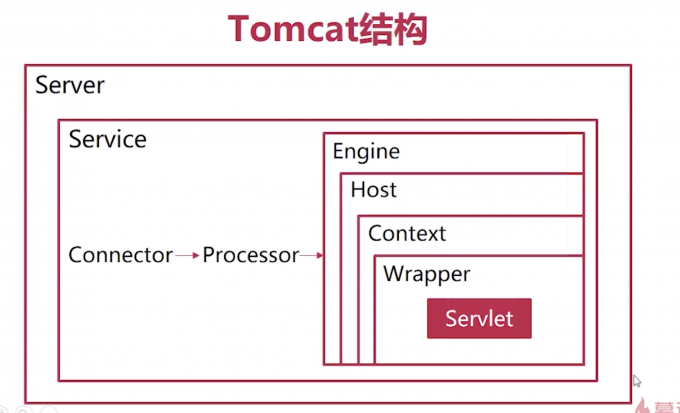
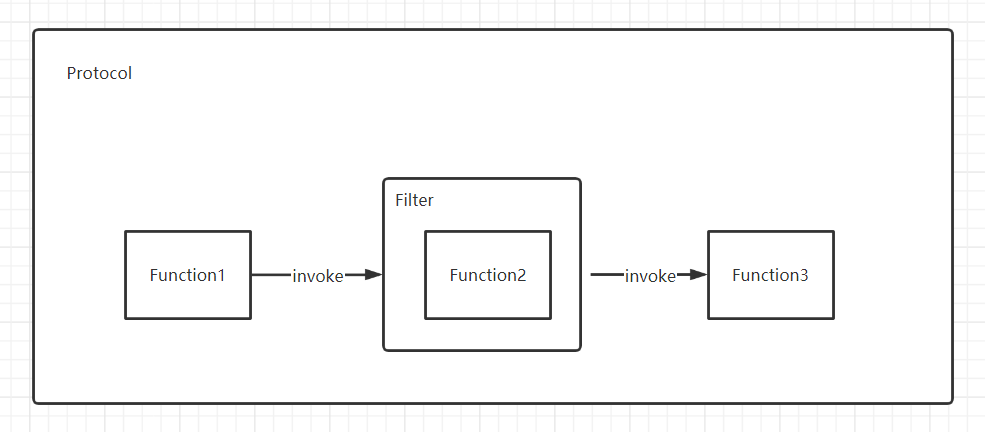
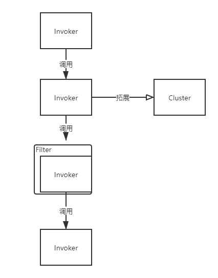
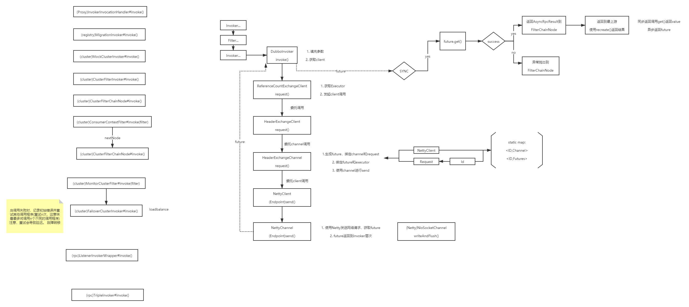

## Meetup 信息

时间： 2021年6月15日，下午2点-4点

地点：上海市凌空SOHO

### 概要

梳理Dubbo的调用链路流程，分析其设计理念和思路，以及阅读其中关键步骤的源码逻辑

#### Review

> 在 RPC 中，Protocol 是核心层，也就是只要有 Protocol + Invoker + Exporter 就可以完成非透明的 RPC 调用，然后在 Invoker 的主过程上 Filter 拦截点。

调用流程主要围绕`Protocol`/`Invoker`/`Filter`三个接口进行

```java
public interface Protocol {

    <T> Exporter<T> export(Invoker<T> invoker) throws RpcException;

    <T> Invoker<T> refer(Class<T> type, URL url) throws RpcException;

    void destroy();
}
```

```java
public interface Invoker<T> extends Node {

    Result invoke(Invocation invocation) throws RpcException;

    void destroy();
}
```

```java
public interface Filter extends BaseFilter {

    Result invoke(Invoker<?> invoker, Invocation invocation) throws RpcException;
}
```

## 整体流程


### 初始化流程

1. 初始化配置相关.......
2. 初始化`Protocol`
3. 初始化`Invoker`
3. 初始化底层资源

### 调用流程

1. 调用`Invoker`，做一些逻辑
2. 调用`Filter`，做一些逻辑
3. 调用`Invoker`，做一些逻辑
4. 调用底层资源

## 简化设计

从一个Client开始......

#### 1. 直接调用



#### 2. 责任链模式

解决函数逻辑的水平拓展问题



定义接口：`Response invoke(Request request);`

```java
public interface Invoker<T> extends Node {

    Result invoke(Invocation invocation) throws RpcException;

    void destroy();
}
```

#### 3. 过滤器插件



#### 在重要的过程上设置拦截接口

如果你要写个远程调用框架，那远程调用的过程应该有一个统一的拦截接口。如果你要写一个 ORM 框架，那至少 SQL 的执行过程，Mapping 过程要有拦截接口；如果你要写一个 Web 框架，那请求的执行过程应该要有拦截接口，等等。没有哪个公用的框架可以 Cover 住所有需求，允许外置行为，是框架的基本扩展方式。这样，如果有人想在远程调用前，验证下令牌，验证下黑白名单，统计下日志；如果有人想在 SQL 执行前加下分页包装，做下数据权限控制，统计下 SQL 执行时间；如果有人想在请求执行前检查下角色，包装下输入输出流，统计下请求量，等等，就可以自行完成，而不用侵入框架内部。**拦截接口，通常是把过程本身用一个对象封装起来，传给拦截器链，比如：远程调用主过程为 invoke()，那拦截器接口通常为 invoke(Invocation)，Invocation 对象封装了本来要执行过程的上下文，并且 Invocation 里有一个 invoke() 方法，由拦截器决定什么时候执行，同时，Invocation 也代表拦截器行为本身，这样上一拦截器的 Invocation 其实是包装的下一拦截器的过程，直到最后一个拦截器的 Invocation 是包装的最终的 invoke() 过程**；同理，SQL 主过程为 execute()，那拦截器接口通常为 execute(Execution)，原理一样。当然，实现方式可以任意，上面只是举例。

```java
public interface Filter extends BaseFilter {

    Result invoke(Invoker<?> invoker, Invocation invocation) throws RpcException;
}
```

**装饰模式/组合模式**



#### 4. 领域模型的设计

**重资源 -> 资源的管理 -> 生命周期**

资源的管理：

共享、创建、释放、生命周期........

链路治理、上下文、组装........

#### 领域模型



在 Dubbo 的核心领域模型中：

* Protocol 是服务域，它是 Invoker 暴露和引用的主功能入口，它负责 Invoker 的生命周期管理。
* Invoker 是实体域，它是 Dubbo 的核心模型，其它模型都向它靠扰，或转换成它，它代表一个可执行体，可向它发起 invoke 调用，它有可能是一个本地的实现，也可能是一个远程的实现，也可能一个集群实现。
* Invocation 是会话域，它持有调用过程中的变量，比如方法名，参数等。

```java
public interface Protocol {

    <T> Exporter<T> export(Invoker<T> invoker) throws RpcException;

    <T> Invoker<T> refer(Class<T> type, URL url) throws RpcException;

    void destroy();
}
```



共享资源谁持有？

缓存在哪里存储？

线程安全？

单例还是New？

#### 服务域/实体域/会话域分离

任何框架或组件，总会有核心领域模型，比如：Spring 的 Bean，Struts 的 Action，Dubbo 的 Service，Napoli 的 Queue 等等。这个核心领域模型及其组成部分称为实体域，它代表着我们要操作的目标本身。**实体域通常是线程安全的，不管是通过不变类，同步状态，或复制的方式。**①

服务域也就是行为域，它是组件的功能集，同时也负责实体域和会话域的生命周期管理， 比如 Spring 的 ApplicationContext，Dubbo 的 ServiceManager 等。**服务域的对象通常会比较重，而且是线程安全的，并以单一实例服务于所有调用。**②

什么是会话？就是一次交互过程。会话中重要的概念是上下文，什么是上下文？比如我们说：“老地方见”，这里的“老地方”就是上下文信息。为什么说“老地方”对方会知道，因为我们前面定义了“老地方”的具体内容。所以说，上下文通常持有交互过程中的状态变量等。**会话对象通常较轻，每次请求都重新创建实例，请求结束后销毁。简而言之：把元信息交由实体域持有**③，把一次请求中的临时状态由会话域持有，由服务域贯穿整个过程。

① `Invoker`仅维护自己的状态，类似Actor设计模式

② `Protocol`初始化为单例，并且持有缓存Map

③ `Invoker`中存储默认元信息，临时信息存储到`Invocation`

=> show code

#### 4.1 资源的销毁

由服务域管理资源的生命周期，并委托给实体域执行

```java
public interface Protocol {

    <T> Exporter<T> export(Invoker<T> invoker) throws RpcException;

    <T> Invoker<T> refer(Class<T> type, URL url) throws RpcException;

    void destroy();
}
```

```java
public interface Invoker<T> extends Node {

    Result invoke(Invocation invocation) throws RpcException;

    void destroy();
}
```

#### 4.2 状态的监听

#### 重要的状态的变更发送事件并留出监听接口

这里先要讲一个事件和上面拦截器的区别，拦截器是干预过程的，它是过程的一部分，是基于过程行为的，而事件是基于状态数据的，任何行为改变的相同状态，对事件应该是一致的。事件通常是事后通知，是一个 Callback 接口，方法名通常是过去式的，比如 onChanged()。比如远程调用框架，当网络断开或连上应该发出一个事件，当出现错误也可以考虑发出一个事件，这样外围应用就有可能观察到框架内部的变化，做相应适应。

```java
public interface InvokerListener {

    void referred(Invoker<?> invoker) throws RpcException;

    void destroyed(Invoker<?> invoker);
}
```

#### 4.3 纵向拓展

SPI，微内核，插件化

#### 微核插件式，平等对待第三方

大凡发展的比较好的框架，都遵守微核的理念。Eclipse 的微核是 OSGi， Spring 的微核是 BeanFactory，Maven 的微核是 Plexus。通常核心是不应该带有功能性的，而是一个生命周期和集成容器，这样各功能可以通过相同的方式交互及扩展，并且任何功能都可以被替换。如果做不到微核，至少要平等对待第三方，即原作者能实现的功能，扩展者应该可以通过扩展的方式全部做到。原作者要把自己也当作扩展者，这样才能保证框架的可持续性及由内向外的稳定性。

引入配置模块，担当微内核。并负责`Protocol`的初始化启动（Protocol再负责下层的初始化）

#### 4.4 完善的分层

* **config 配置层**：对外配置接口，以 ServiceConfig, ReferenceConfig 为中心，可以直接初始化配置类，也可以通过 spring 解析配置生成配置类
* **proxy 服务代理层**：服务接口透明代理，生成服务的客户端 Stub 和服务器端 Skeleton, 以 ServiceProxy 为中心，扩展接口为 ProxyFactory
* **registry 注册中心层**：封装服务地址的注册与发现，以服务 URL 为中心，扩展接口为 RegistryFactory, Registry, RegistryService
* **cluster 路由层**：封装多个提供者的路由及负载均衡，并桥接注册中心，以 Invoker 为中心，扩展接口为 Cluster, Directory, Router, LoadBalance
* monitor 监控层：RPC 调用次数和调用时间监控，以 Statistics 为中心，扩展接口为 MonitorFactory, Monitor, MonitorService
* **protocol 远程调用层**：封装 RPC 调用，以 Invocation, Result 为中心，扩展接口为 Protocol, Invoker, Exporter
* exchange 信息交换层：封装请求响应模式，同步转异步，以 Request, Response 为中心，扩展接口为 Exchanger, ExchangeChannel, ExchangeClient, ExchangeServer
* transport 网络传输层：抽象 mina 和 netty 为统一接口，以 Message 为中心，扩展接口为 Channel, Transporter, Client, Server, Codec
* serialize 数据序列化层：可复用的一些工具，扩展接口为 Serialization, ObjectInput, ObjectOutput, ThreadPool

其他层次以插件的方式装配到config里，核心仍然是`Protocol`层。功能要么伪装成`Invoker`，要么在初始化时进行。

> 在 RPC 中，Protocol 是核心层，也就是只要有 Protocol + Invoker + Exporter 就可以完成非透明的 RPC 调用，然后在 Invoker 的主过程上 Filter 拦截点。


层级关系：

    -system
    -config
    -proxy
    -registry
    -cluster
    -monitor
    -protocol
        -invoker
            -exchange
            -...



#### 5. 异步调用

```java
public interface Result extends Serializable {

    Result whenCompleteWithContext(BiConsumer<Result, Throwable> fn);
}
```

### 重点关注点

结合一开始的大概流程...

#### 1. protocol初始化流程

初始化的时候做了什么？集群？注册发现？代理封装？

资源如何加载？如何缓存？连接池？线程池？

........

#### 2. invoke流程

实际调用过程的流程？有哪些逻辑步骤？

负载均衡？重试？监控？序列化？

同步异步？流式调用？

........

## Invoke流程解读


### 调用流程



### 源码分析

关键Invoker的逻辑：

`AbstractInvoker`: 3个步骤，（PR：https://github.com/apache/dubbo/pull/7952）

具体逻辑在`doInvoke`中

#### `FailoverClusterInvoker`

当调用失败时，记录初始错误并重试其他调用程序(重试n次，这意味着最多将调用n个不同的调用程序)注意，重试会导致延迟。 故障转移

图中方法：list、route、select

什么时候会重试？非biz异常，但粒度很粗....（Issue相关）

#### `ListenerInvokerWrapper`

注册invoker的listener，并进行操作，装饰模式

改进：观察者模式+生命周期

#### `FilterChainNode`

实际上是Invoker，但内部保存了Filter

Invoker装饰，Filter适配，两者的组合

#### `DubboInvoker`

可以看到：Invoker层持有下层的资源管理

接下来就是`excahnge`层的逻辑

#### `TripleInvoker`

直接持有底层netty资源，比较粗糙

=> show code

## 总结

### 1.层次结构

层级关系：

    -system
    -config
    -proxy
    -registry
    -cluster
    -monitor
    -protocol
        -invoker
            -exchange
            -...

### 2.调用流程


### 3.设计模式

责任链：Invoker

适配器：适配到Invoker责任链中

装饰：对Invoker进行增强

.........

### 4.设计优化

Invoker调用链：√，整个系统的核心，插件化功能采用拓展接口的方式，各个模块功能比较明确

Lifecycle生命周期：不完全，没有完整的生命周期；对于生命周期的事件处理比较硬编码

Listener：装饰的比较硬编码，事件阶段不够全，拓展性不够好

Filter：采用装饰模型而非组合模型，拓展性较差；嵌套层级深，调试时链路不清晰

........